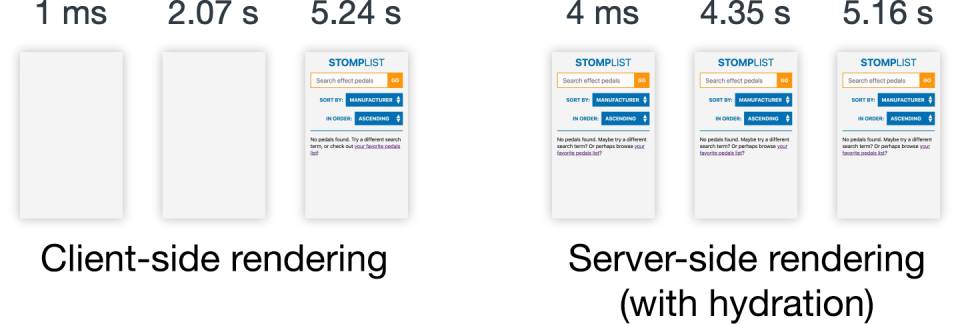

### 2019.04.19

1. 我们如何使用WebAssembly加速我们的Web应用程序20倍（案例研究）

[https://www.smashingmagazine.com/2019/04/webassembly-speed-web-app/](https://www.smashingmagazine.com/2019/04/webassembly-speed-web-app/)

2. 你不再需要jQuery总结一些jQuery api的替代方案

[https://github.com/nefe/You-Dont-Need-jQuery/blob/master/README.zh-CN.md](https://github.com/nefe/You-Dont-Need-jQuery/blob/master/README.zh-CN.md)

3. 适用于Vue开发人员的一体化原型工具。

[https://github.com/teamprevue/PreVue](https://github.com/teamprevue/PreVue)

4. Javascript要为性能负责，正因为Javascript越来越势强，web网页的性能越来越差。作者认为我们正在过度使用JS。在你的项目中使用`npm ls --prod`试试看。

[https://alistapart.com/article/responsible-javascript-part-1](https://alistapart.com/article/responsible-javascript-part-1)

[https://medium.com/@addyosmani/the-cost-of-javascript-in-2018-7d8950fbb5d4](https://medium.com/@addyosmani/the-cost-of-javascript-in-2018-7d8950fbb5d4)



5. Aroma: 机器学习推荐代码

[https://ai.facebook.com/blog/aroma-ml-for-code-recommendation/](https://ai.facebook.com/blog/aroma-ml-for-code-recommendation/)

6. Chrome 75 将原生支持图片懒加载

```html

<iframe src="video-player.html" loading="lazy"></iframe>
```

[https://addyosmani.com/blog/lazy-loading/](https://addyosmani.com/blog/lazy-loading/)

7. a标签的点击追踪策略往往因为页面卸载而终止ajax请求从而没法追踪到，下文是应对这种场景的解决方案，navigator.sendBeacon就是其中一个

[https://webkit.org/blog/8821/link-click-analytics-and-privacy/](https://webkit.org/blog/8821/link-click-analytics-and-privacy/)

[http://www.ruanyifeng.com/blog/2019/04/user-tracking.html](http://www.ruanyifeng.com/blog/2019/04/user-tracking.html)