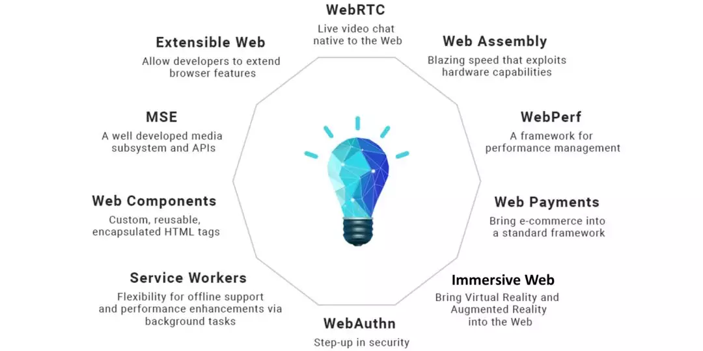

### 2019.05.17

1. 前端精读周刊

[https://github.com/dt-fe/weekly](https://github.com/dt-fe/weekly)

2. 用css实现的聊天室，不用js

[https://github.com/kkuchta/css-only-chat](https://github.com/kkuchta/css-only-chat)


3. JS 中 Number 类型数据总共有多少个？答案是 `18437736874454810627`

[https://juejin.im/post/5cd379a051882535786bc34f](https://juejin.im/post/5cd379a051882535786bc34f)

4. [Google I/O ’19] What’s new in JavaScript

[https://www.youtube.com/watch?v=c0oy0vQKEZE](https://www.youtube.com/watch?v=c0oy0vQKEZE)

5. Web技术的现在与未来，在拓展 Web 核心能力方面，W3C 当前的关注重点包括：

- WebRTC：Web 上原生的视频通话能力；
- Web Assembly：极大提升性能，以及将其它语言生态引入 Web；
- WebPerf：Web 应用的性能管理框架；
- Web Payments：原生的 Web 支付 API 标准；
- Immersive Web：让 Web 原生支持 VR 和 AR；
- WebAuthn：Web 原生验证；
- Service Workers：通过后台任务来支持离线以及提升性能；
- Web Components：自定义可重用的 Web 组件；
- MSE：多媒体子系统和 API；
- Extensive Web：允许开发者扩展浏览器功能。

[https://mp.weixin.qq.com/s?__biz=MzUxMzcxMzE5Ng==&mid=2247491186&idx=1&sn=235f648fccaf0e2769fa5044418a8b4d](https://mp.weixin.qq.com/s?__biz=MzUxMzcxMzE5Ng==&mid=2247491186&idx=1&sn=235f648fccaf0e2769fa5044418a8b4d)



6. 关于微软决定于Google合作开发基于Chromium的Edge浏览器的故事，尽管火狐认为这可能导致WEB标准独裁的决定，并打算[fight for a truly open web](https://www.theverge.com/2018/12/6/18129287/google-microsoft-edge-chromium-response)

[https://www.theverge.com/2019/5/6/18527550/microsoft-chromium-edge-google-history-collaboration](https://www.theverge.com/2019/5/6/18527550/microsoft-chromium-edge-google-history-collaboration)

7. 在流行的Axios HTTP库中发现了一个DoS漏洞，恶意服务器运营商可能会破坏您的客户端代码。如果您使用axios从不受信任的来源或通过不安全的媒体请求资源，那么您可能容易受到拒绝服务的攻击，恶意用户可以在其中控制远程资源。其中一种解决方案是：

```javascript
axios({
	url: ...,
	maxContentLength: 2000,
}).catch((error) => {
	error.request.res.destroy();
});
```

[https://snyk.io/blog/a-denial-of-service-vulnerability-discovered-in-the-axios-javascript-package-affecting-all-versions-of-the-popular-http-client/](https://snyk.io/blog/a-denial-of-service-vulnerability-discovered-in-the-axios-javascript-package-affecting-all-versions-of-the-popular-http-client/)

8. JavaScript内存机制

[https://juejin.im/post/5cd8e66d51882568cb68b03e](https://juejin.im/post/5cd8e66d51882568cb68b03e)
