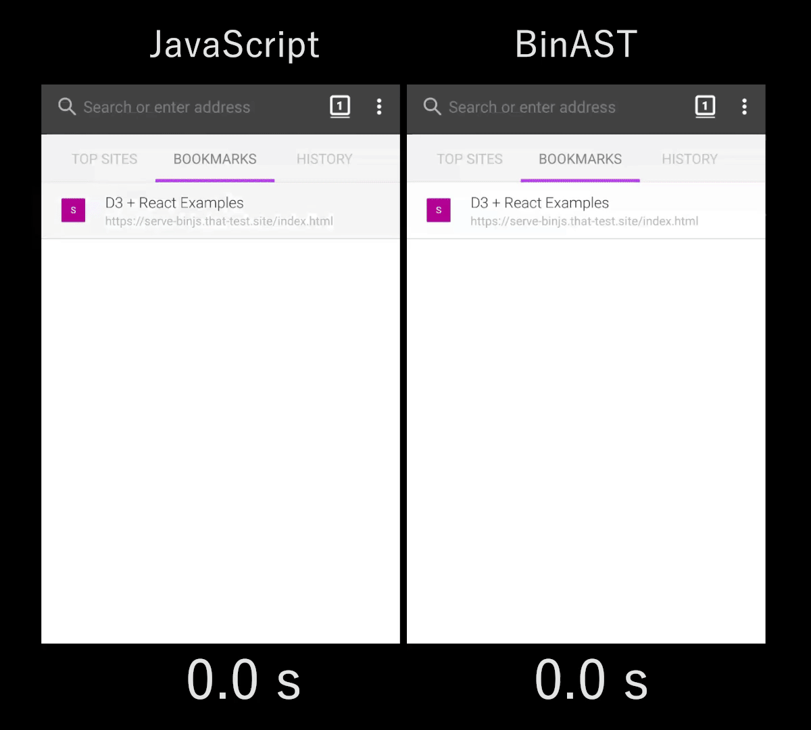

### 2019.05.24

1. 命令行的艺术

[https://github.com/jlevy/the-art-of-command-line/blob/master/README-zh.md](https://github.com/jlevy/the-art-of-command-line/blob/master/README-zh.md)

2. 啥是serverless，简单说就是去后端化

[https://juejin.im/post/5cdc3dc2e51d453b6c1d9d3a](https://juejin.im/post/5cdc3dc2e51d453b6c1d9d3a)

3. “For things I don't know how to build，I don't understand.”（我不能创造的东西，我就不了解）

[https://mp.weixin.qq.com/s/BRyZP0LDIYoopIvz4VK0Kw](https://mp.weixin.qq.com/s/BRyZP0LDIYoopIvz4VK0Kw)

4. 对开发人员有用的定律、理论、原则和模式

[https://github.com/nusr/hacker-laws-zh](https://github.com/nusr/hacker-laws-zh)

5. 很炫酷的网页流体效果

[https://github.com/PavelDoGreat/WebGL-Fluid-Simulation](https://github.com/PavelDoGreat/WebGL-Fluid-Simulation)

6. 微人事是一个前后端分离的人力资源管理系统，项目采用SpringBoot+Vue开发。

[https://github.com/lenve/vhr](https://github.com/lenve/vhr)

7. 那些工作“996”的人，怎样保持健康习惯？身体更重要，其他的都不重要。

[https://www.infoq.cn/article/pA6OGpJtq0f*LeTyZibu?utm_source=rss&utm_medium=article](https://www.infoq.cn/article/pA6OGpJtq0f*LeTyZibu?utm_source=rss&utm_medium=article)

8. 北大 AI 公开课 2019 | 阿里达摩院施尧耘：量子计算的潜力和挑战

[https://www.infoq.cn/article/Zzi9XxhyWAweHR-CLTKm?utm_source=rss&utm_medium=article](https://www.infoq.cn/article/Zzi9XxhyWAweHR-CLTKm?utm_source=rss&utm_medium=article)

9. 使用BinaryAST加载更快的脚本？为了加快网页打开时间，减少白屏时间，这篇从js编译的角度出发，减少js parse的时间，从而提高网页冷启动的时间。BinaryAST是Mozilla提出并积极开发的一种新的线上格式，旨在加快解析速度，同时保持原始JavaScript的语义不变。它通过为代码和数据结构使用有效的二进制表示，以及通过存储和提供额外信息来提前指导解析器来实现。

[https://blog.cloudflare.com/binary-ast/](https://blog.cloudflare.com/binary-ast/)

10. 受Express路由器启发的微客户端路由器

[https://github.com/visionmedia/page.js](https://github.com/visionmedia/page.js)
