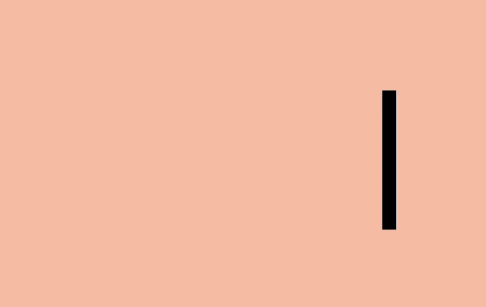
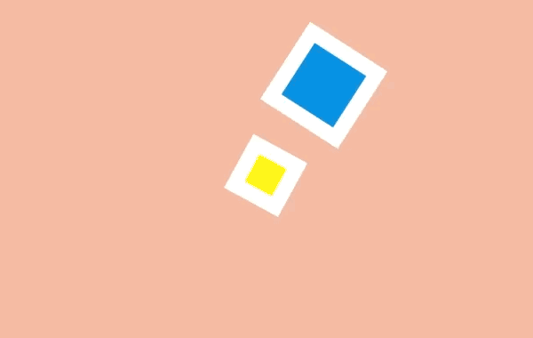
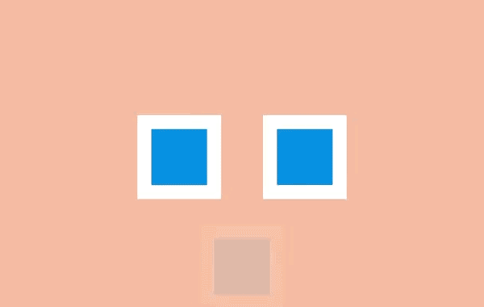
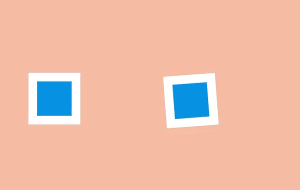
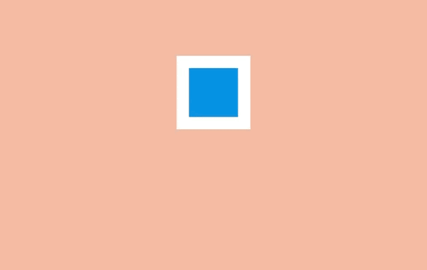
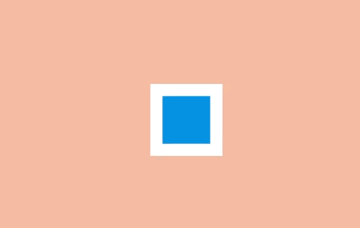

     CSS的Animation是一个很有意思的东西，也是CSS中较为复杂也难设计的一部分。熟不知在Web的动画设计中有12个关键原则。在Animation 101将这十二原则剖析出来。今天特意转载 @刘英滕 翻译《Animation Principles for the Web》的中文。

作为前端的设计师和工程师，我们用 CSS 去做样式、定位并创建出好看的网站。我们经常用 CSS 去添加页面的运动过渡效果甚至动画，但我们经常做的东西不会超过这些。

衡选动效是一个有助于访客和消费者理解我们设计的强有力工具。这里有些原则能最大限度地应用在我们的工作中。

迪士尼经过基础工作练习的长时间累积，在 1981 年出版的 The Illusion of Life: Disney Animation 一书中发表了动画的十二个原则 (12 Principles of Animation) 。这些原则描述了动画能怎样用于让观众相信自己沉浸在现实世界中。

在本文中，我会逐个介绍这十二个原则，并讨论它们怎样运用在网页中。你能在[Codepen](http://codepen.io/collection/AxKOdY/)找到它们全部的开源 HTML 和 CSS 代码 。择你喜欢的那一个。个模块系统，它将支撑你的每一个项目。止你解决它。

##挤压和拉伸 (Squash and stretch)
----

这是物体存在质量且运动时质量保持不变的概念。当一个球在弹跳时，碰击到地面会变扁，恢复的时间会越来越短。

创建对象的时候最有用的方法是参照实物，比如人、时钟和弹性球。

当它和网页元件一起工作时可能会忽略这个原则。DOM 对象不一定和实物相关，它会按需要在屏幕上缩放。例如，一个按钮会变大并变成一个信息框，或者错误信息会出现和消失。

尽管如此，挤压和伸缩效果可以为一个对象增加实物的感觉。甚至一些形状上的小变化就可以创造出细微但抢眼的效果。

##预备动作 (Anticipation)
---

运动不倾向于突然发生。在现实生活中，无论是一个球在掉到桌子前就开始滚动，或是一个人屈膝准备起跳，运动通常有着某种事先的累积。

我们能用它去让我们的过渡动画显得更逼真。预备动作可以是一个细微的反弹，帮人们理解什么对象将在屏幕中发生变化并留下痕迹。

例如，悬停在一个元件上时可以在它变大前稍微缩小，在初始列表中添加额外的条目来介绍其它条目的移除方法。

##演出布局 (Staging)
---

演出布局是确保对象在场景中得以聚焦，让场景中的其它对象和视觉在主动画发生的地方让位。这意味着要么把主动画放到突出的位置，要么模糊其它元件来让用户专注于看他们需要看的东西。

在网页方面，一种方法是用 model 覆盖在某些内容上。在现有页面添加一个遮罩并把那些主要关注的内容前置展示。

另一种方法是用动作。当很多对象在运动，你很难知道哪些值得关注。如果其它所有的动作停止，只留一个在运动，即使动得很微弱，这都可以让对象更容易被察觉。

还有一种方法是做一个晃动和闪烁的按钮来简单地建议用户比如他们可能要保存文档。屏幕保持静态，所以再细微的动作也会突显出来。

##连续运动和姿态对应 (Straight-Ahead Action and Pose-to-Pose)
---

连续运动是绘制动画的每一帧，姿态对应是通常由一个 assistant 在定义一系列关键帧后填充间隔。

大多数网页动画用的是姿态对应：关键帧之间的过渡可以通过浏览器在每个关键帧之间的插入尽可能多的帧使动画流畅。

有一个例外是定时功能step。通过这个功能，浏览器 "steps" 可以把尽可能多的无序帧串清晰。你可以用这种方式绘制一系列图片并让浏览器按顺序显示出来，这开创了一种逐帧动画的风格。

##跟随和重叠动作 (Follow Through and Overlapping Action)
---

事情并不总在同一时间发生。当一辆车从急刹到停下，车子会向前倾、有烟从轮胎冒出来、车里的司机继续向前冲。

这些细节是跟随和重叠动作的例子。它们在网页中能被用作帮助强调什么东西被停止，并不会被遗忘。例如一个条目可能在滑动时稍滑微远了些，但它自己会纠正到正确位置。

要创造一个重叠动作的感觉，我们可以让元件以稍微不同的速度移动到每处。这是一种在 iOS 系统的视窗 (View) 过渡中被运用得很好的方法。一些按钮和元件以不同速率运动，整体效果会比全部东西以相同速率运动要更逼真，并留出时间让访客去适当理解变化。

在网页方面，这可能意味着让过渡或动画的效果以不同速度来运行。

##缓入缓出 (Slow In and Slow Out)
---

对象很少从静止状态一下子加速到最大速度，它们往往是逐步加速并在停止前变慢。没有加速和减速，动画感觉就像机器人。

在 CSS 方面，缓入缓出很容易被理解，在一个动画过程中计时功能是一种描述变化速率的方式。

使用计时功能，动画可以由慢加速 (ease-in)、由快减速 (ease-out)，或者用贝塞尔曲线做出更复杂的效果。

##弧线运动 (Arc)
---

虽然对象是更逼真了，当它们遵循「缓入缓出」的时候它们很少沿直线运动——它们倾向于沿弧线运动。

我们有几种 CSS 的方式来实现弧线运动。一种是结合多个动画，比如在弹力球动画里，可以让球上下移动的同时让它右移，这时候球的显示效果就是沿弧线运动。

另外一种是旋转元件，我们可以设置一个在对象之外的原点来作为它的旋转中心。当我们旋转这个对象，它看上去就是沿着弧线运动。

##次要动作 (Secondary Action)
---

虽然主动画正在发生，次要动作可以增强它的效果。这就好比某人在走路的时候摆动手臂和倾斜脑袋，或者弹性球弹起的时候扬起一些灰尘。

在网页方面，当主要焦点出现的时候就可以开始执行次要动作，比如拖拽一个条目到列表中间。

##时间节奏 (Timing)
---

动画的时间节奏是需要多久去完成，它可以被用来让看起来很重的对象做很重的动画，或者用在添加字符的动画中。

这在网页上可能只要简单调整 animation-duration 或 transition-duration 值。

这很容易让动画消耗更多时间，但调整时间节奏可以帮动画的内容和交互方式变得更出众。

##夸张手法 (Exaggeration)
---

夸张手法在漫画中是最常用来为某些动作刻画吸引力和增加戏剧性的，比如一只狼试图把自己的喉咙张得更开地去咬东西可能会表现出更恐怖或者幽默的效果。

在网页中，对象可以通过上下滑动去强调和刻画吸引力，比如在填充表单的时候生动部分会比收缩和变淡的部分更突出。

##扎实的描绘 (Solid drawing)
---

当动画对象在三维中应该加倍注意确保它们遵循透视原则。因为人们习惯了生活在三维世界里，如果对象表现得与实际不符，会让它看起来很糟糕。

如今浏览器对三维变换的支持已经不错，这意味着我们可以在场景里旋转和放置三维对象，浏览器能自动控制它们的转换。

##吸引力 (Appeal)
---

吸引力是艺术作品的特质，让我们与艺术家的想法连接起来。就像一个演员身上的魅力，是注重细节和动作相结合而打造吸引性的结果。

精心制作网页上的动画可以打造出吸引力，例如 Stripe 这样的公司用了大量的动画去增加它们结账流程的可靠性。

-------------------------

####扩展
* [动画的12项基本法则](http://zh.m.wikipedia.org/wiki/%E5%8B%95%E7%95%AB%E7%9A%8412%E9%A0%85%E5%9F%BA%E6%9C%AC%E6%B3%95%E5%89%87)
* [动画的12项基本法则(视频)](https://www.youtube.com/watch?v=GcryIdriSe4)
* [Designing with animation](https://www.youtube.com/watch?v=TMe0WnkF1Lc&list=UURx1y52pfeMwbuer9Vh2u-A)

-----

特别声明：本文转自@刘英滕翻译的《[Animation Principles for the Web](https://cssanimation.rocks/principles/)》,如需转载，请注明中文出处：[http://www.jianshu.com/p/1858a8733ba3](http://www.jianshu.com/p/1858a8733ba3)。

--------------------------
*转载自：*[https://cssanimation.rocks/principles/](https://cssanimation.rocks/principles/)

