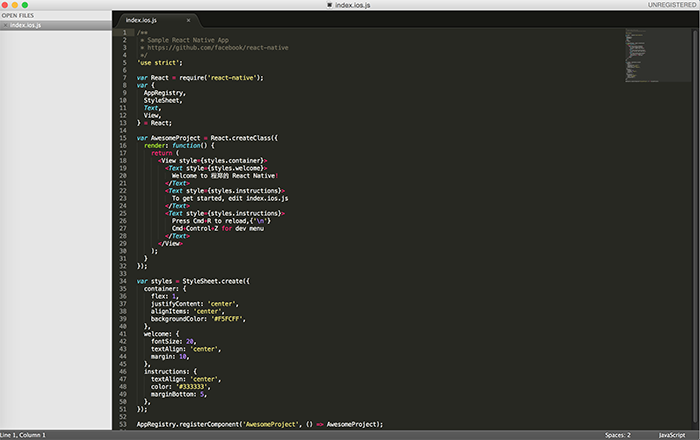
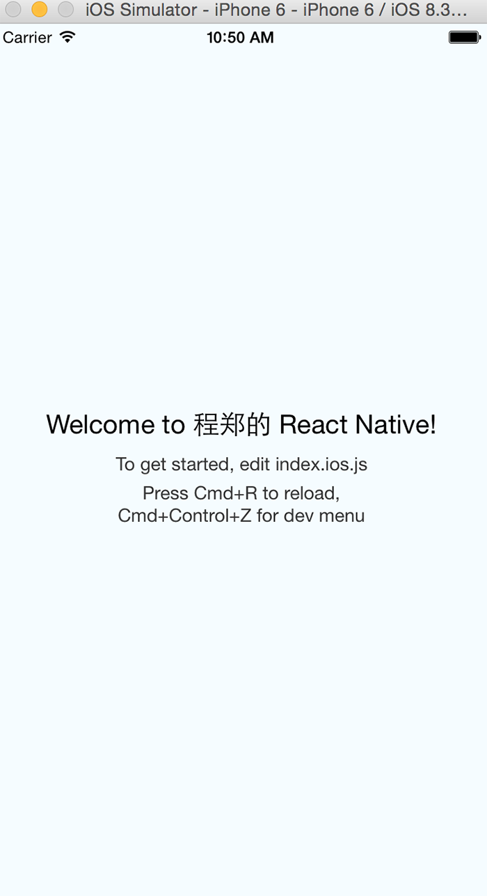

三月份的时候，Facebook开源了react native，口号是learn once，write anywhere。很快这个用js写ios原生app的开源项目得到了极大地关注。我也在最近试玩了一下这个开源项目。

通过修改jsx文件，就可以修改和编写ios原生应用，确实很不错。

电影《社交网络》讲述Facebook创始人Mark zuckerberg个人传奇，Facebook起源于一次被甩后的网络暴力，跟女朋友分手后的Mark十分不爽，从在自己的博客上谩骂到盗取全校女学生的头像来发起一次网络选美，最终导致哈佛的网络因为流量过大而当机，显示了浏览器的力量。

可能从一开始Facebook都是浏览器端的，所以在移动互联网到来以后，大家都在谈论浏览器已死，app永生的时候，在2011年，Facebook启动了一个针对原生app的计划——Spartan project，正值HTML5的唱好期，Facebook不打算开发自己的APP，他们打算使用HTML5打造一款浏览器应用，这样可以不用通过苹果的应用商店的审核，相对更加开放，而且只要浏览器标准升级，同样的东西可以在任何其他平台使用，这确实是很诱人的。当时Facebook坚信他们可以做到这些，直到2012年Mark承认他高估了HTML5的力量。2012年，Mark Zuckerberg承认：专注在HTML5上面是他有史以来犯过的最大的错误。在浏览器上差强人意的用户体验，让Facebook差点没跟上移动互联网的节奏。而在3月份开源的react native，Facebook认为：

>尽管Native开发成本更高，但现阶段Native仍然是必须的，因为Web的用户体验仍无法超越Native：

1. Native的原生控件有更好的体验；
2. Native有更好的手势识别；
3. Native有更合适的线程模型，尽管Web Worker可以解决一部分问题，但如图像解码、文本渲染仍无法多线程渲染，这影响了Web的流畅性。

